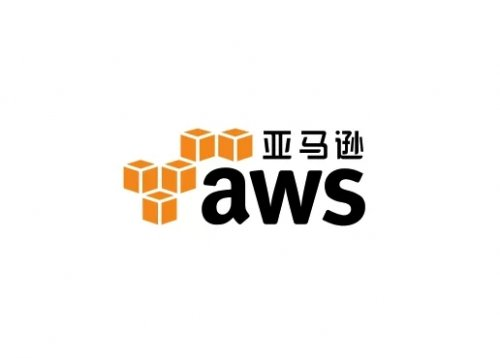
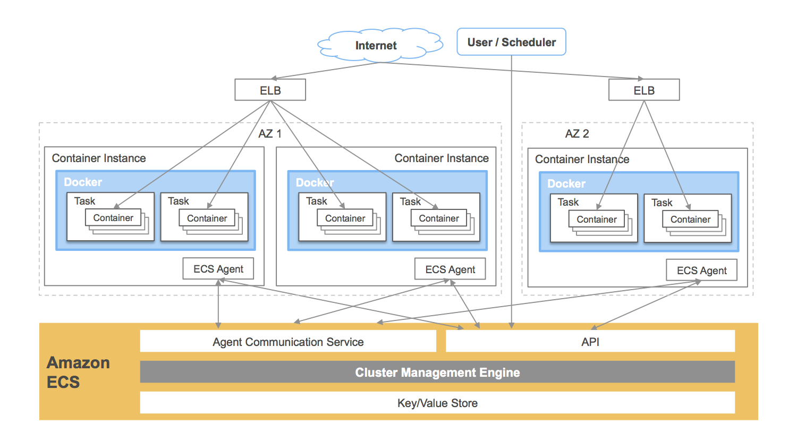

# 亚马逊云

[AWS](https://www.amazonaws.cn)，即 Amazon Web Services，是亚马逊（Amazon）公司的 IaaS 和 PaaS 平台服务。AWS 提供了一整套基础设施和应用程序服务，使用户几乎能够在云中运行一切应用程序：从企业应用程序和大数据项目，到社交游戏和移动应用程序。AWS 面向用户提供包括弹性计算、存储、数据库、应用程序在内的一整套云计算服务，能够帮助企业降低 IT 投入成本和维护成本。

自 2006 年初起，亚马逊 AWS 开始在云中为各种规模的公司提供技术服务平台。利用亚马逊 AWS，软件开发人员可以轻松购买计算、存储、数据库和其他基于 Internet 的服务来支持其应用程序。开发人员能够灵活选择任何开发平台或编程环境，以便于其尝试解决问题。由于开发人员只需按使用量付费，无需前期资本支出，亚马逊 AWS 是向最终用户交付计算资源、保存的数据和其他应用程序的一种经济划算的方式。

2015 年 AWS 正式发布了 EC2 容器服务(ECS)。ECS 的目的是让 Docker 容器变的更加简单，它提供了一个集群和编排的层，用来控制主机上的容器部署，以及部署之后的集群内的容器的生命周期管理。ECS 是诸如 Docker Swarm、Kubernetes、Mesos 等工具的替代，它们工作在同一个层，除了作为一个服务来提供。这些工具和 ECS 不同的地方在于，前者需要用户自己来部署和管理，而 ECS 是“作为服务”来提供的。

